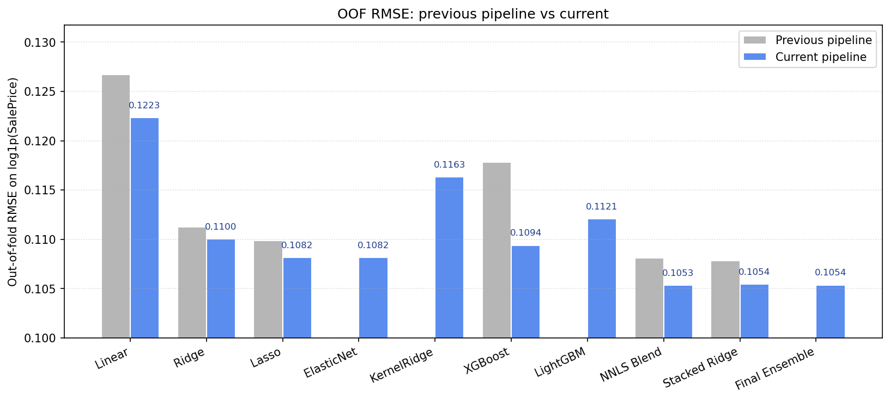
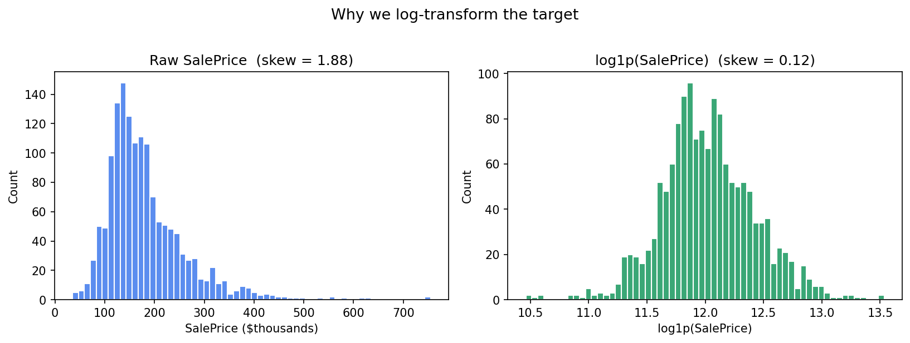
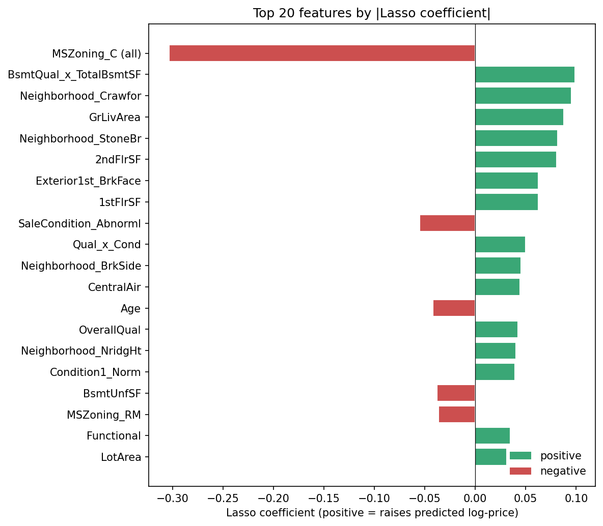
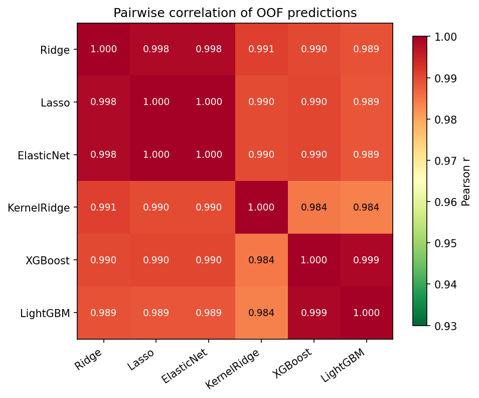
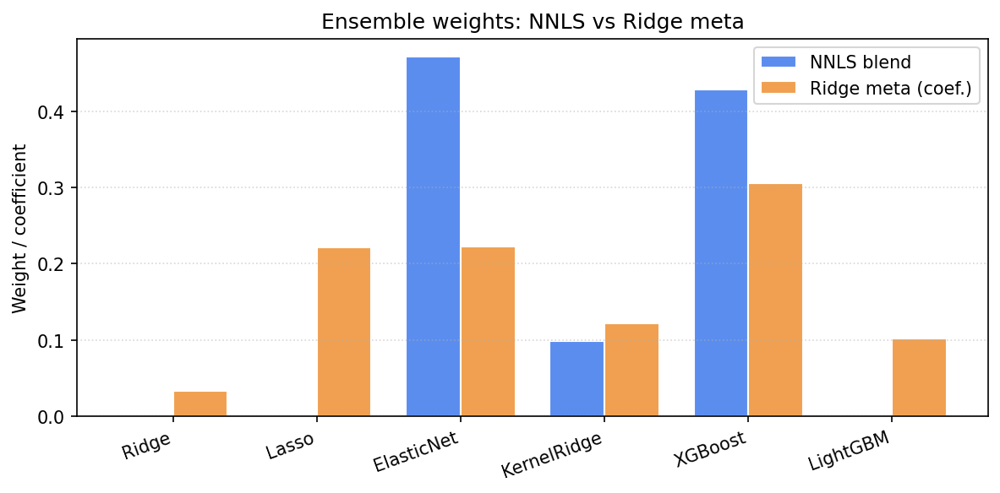
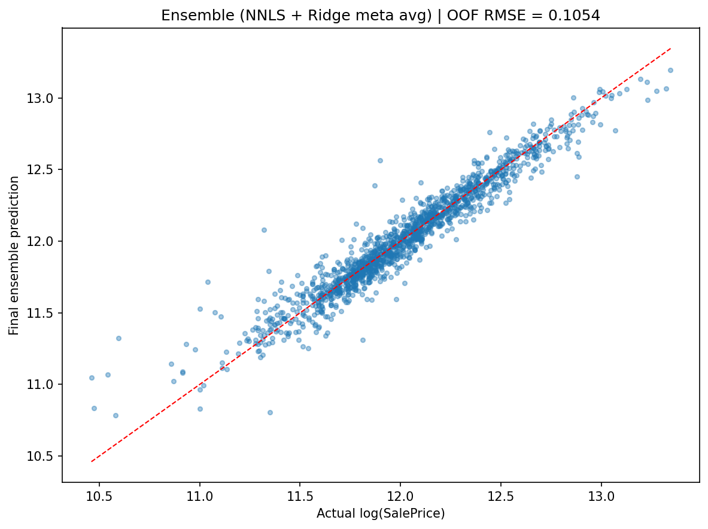

# Housing Prices Prediction

Predicting sale prices on the [Ames Housing Dataset](https://www.kaggle.com/c/house-prices-advanced-regression-techniques) — a small (n = 1460) but feature-rich regression problem that's a great sandbox for thinking about preprocessing, regularisation, and ensembling.

I started this project in November 2024 as one of my first real ML pieces. I came back to it during an Intro to Machine Learning class and gave it a thorough rewrite: the old code worked and produced reasonable numbers, but reading it again with more vocabulary I could see several things I would do differently. This README is partly a results writeup and partly a record of those decisions — what I changed, why each change actually moves the needle, and where the limits are.

---

## Table of Contents

- [Headline results](#headline-results)
- [The data, and why log the target](#the-data-and-why-log-the-target)
- [Preprocessing](#preprocessing)
- [What the model thinks matters](#what-the-model-thinks-matters)
- [Modeling architecture](#modeling-architecture)
- [Ensembling: NNLS blend vs Ridge meta](#ensembling-nnls-blend-vs-ridge-meta)
- [What changed and why](#what-changed-and-why)
- [Usage](#usage)
- [Dependencies](#dependencies)

---

## Headline results

Out-of-fold (OOF) RMSE on `log1p(SalePrice)` — i.e. RMSLE on the original scale, which is exactly what Kaggle scores. 14-fold cross validation, `random_state=42`.

| Model / Ensemble                       | Previous | Current     | Δ          |
| -------------------------------------- | -------- | ----------- | ---------- |
| Linear Regression                      | 0.12672  | 0.12234     | −0.00438   |
| Ridge Regression                       | 0.11126  | 0.11003     | −0.00123   |
| Lasso Regression                       | 0.10988  | 0.10818     | −0.00170   |
| ElasticNet                             | —        | 0.10817     | new        |
| KernelRidge (poly-2)                   | —        | 0.11634     | new        |
| XGBoost (seed-bagged ×3)               | 0.11783  | 0.10940     | −0.00843   |
| LightGBM (seed-bagged ×3)              | —        | 0.11208     | new        |
| **NNLS Blend** (was: Weighted Average) | 0.10809  | **0.10534** | −0.00275   |
| **Stacked Ridge Meta**                 | 0.10786  | **0.10544** | −0.00242   |
| **Final** (0.5·NNLS + 0.5·Stacked)     | —        | **0.10537** | **best**   |



Net: ~**2.3% reduction in RMSE** vs the prior version. Every single base model improved, and adding three more learners (ElasticNet, LightGBM, KernelRidge) plus a leakage fix in the stacker pushed the ensemble well below where it used to be. None of the individual changes is dramatic; the compound effect is.

**Final predictions** ride on the average of two complementary ensembles (NNLS blend + Ridge meta). They get OOF RMSE 0.10534 and 0.10544 respectively, and averaging them lands at 0.10537 — the same ballpark but lower variance. The submission file (`export/submission.csv`) is regenerated end-to-end on every `models.py` run.

---

## The data, and why log the target

Ames has 1460 training rows and 79 feature columns (a mix of numeric and categorical). The target is `SalePrice` in dollars. Two things about that target matter a lot:



The raw `SalePrice` distribution has a heavy right tail — a handful of million-dollar homes drag the skew up to 1.88. Linear models built on top of this would minimise squared error in dollar units, so they'd happily overfit those tail observations and underfit the median. `log1p` collapses the right tail into something close to a normal distribution (skew ≈ 0.12), and as a bonus, RMSE on `log1p(SalePrice)` is exactly the RMSLE that Kaggle scores.

I also drop the two largest-`GrLivArea` rows (> 4000 sq ft) per the dataset author's [recommendation](http://jse.amstat.org/v19n3/decock.pdf) — they're partial sales, not arm's-length transactions, and they're documented outliers.

---

## Preprocessing

Pipeline lives in [`scripts/data_exploration.py`](scripts/data_exploration.py). The headline philosophy: **understand what every `NaN` means before filling it**.

### Missing values aren't always "unknown"

The thing I missed on my first pass through this dataset is that for many features, `NaN` is not missing data — it literally means *the property doesn't have this thing*. `PoolQC = NaN` means "no pool". `GarageType = NaN` means "no garage". Filling these with the column mode (the default reflex) would invent fake garages and fake pools across the dataset.

So the pipeline splits imputation into five strategies based on what the data description actually says:

| Strategy           | Columns                                                                                                                                          | Why                                                                                                          |
| ------------------ | ------------------------------------------------------------------------------------------------------------------------------------------------ | ------------------------------------------------------------------------------------------------------------ |
| Fill with `'None'` | `Alley`, `BsmtQual/Cond/Exposure`, `BsmtFinType1/2`, `Fence`, `FireplaceQu`, `GarageType/Finish/Qual/Cond`, `MasVnrType`, `MiscFeature`, `PoolQC` | `NaN` is semantic ("no pool"); a `'None'` category preserves that distinction.                                |
| Fill with `0`      | `BsmtFinSF1/2`, `BsmtUnfSF`, `TotalBsmtSF`, `BsmtFullBath`, `BsmtHalfBath`, `GarageArea`, `GarageCars`, `MasVnrArea`                             | Same logic for the numeric counterparts — no basement = 0 sq ft.                                              |
| Group-median       | `LotFrontage`                                                                                                                                    | ~18% missing, varies a lot by neighborhood; group-by-`Neighborhood` median is the sharpest non-leaky estimate. |
| Mode               | `MSZoning`, `Electrical`, `KitchenQual`, `Exterior1st/2nd`, `SaleType`                                                                           | True random missingness in 1–4 rows each; mode is harmless.                                                   |
| Domain default     | `Functional` → `'Typ'`                                                                                                                            | The dataset documentation explicitly says to assume `Typ` when missing.                                       |

`GarageYrBlt` is special: it gets a `GarageYrBlt_missing` indicator column before being filled with 0, because "no garage" and "garage built in year 0" should not look identical to the model.

### Ordinal encoding for ordered categoricals

This was the single most embarrassing miss in my old code. Ames has at least ten categorical columns that have **natural orderings** — `ExterQual` is `Ex > Gd > TA > Fa > Po`, `BsmtExposure` is `Gd > Av > Mn > No`, `Functional` is `Typ > Min1 > Min2 > Mod > Maj1 > Maj2 > Sev > Sal`, and so on. My old code one-hot encoded all of these, throwing the ordering away and forcing Ridge/Lasso to relearn it from a handful of rows per dummy.

The new pipeline maps each of these to an integer that respects the ordering:

| Column                                                                                                                                | Ordering (low → high)                              |
| ------------------------------------------------------------------------------------------------------------------------------------- | -------------------------------------------------- |
| `ExterQual`, `ExterCond`, `HeatingQC`, `KitchenQual`, `BsmtQual`, `BsmtCond`, `FireplaceQu`, `GarageQual`, `GarageCond`, `PoolQC`      | `None < Po < Fa < TA < Gd < Ex`                    |
| `BsmtExposure`                                                                                                                        | `None < No < Mn < Av < Gd`                         |
| `BsmtFinType1`, `BsmtFinType2`                                                                                                        | `None < Unf < LwQ < Rec < BLQ < ALQ < GLQ`         |
| `GarageFinish`                                                                                                                        | `None < Unf < RFn < Fin`                           |
| `Fence`                                                                                                                               | `None < MnWw < GdWo < MnPrv < GdPrv`               |
| `Functional`                                                                                                                          | `Sal < Sev < Maj2 < Maj1 < Mod < Min2 < Min1 < Typ`|
| `PavedDrive`                                                                                                                          | `N < P < Y`                                        |
| `LandSlope`                                                                                                                           | `Sev < Mod < Gtl`                                  |
| `LotShape`                                                                                                                            | `IR3 < IR2 < IR1 < Reg`                            |

`CentralAir` collapses to 0/1. Nominal columns (no inherent ordering — `MSZoning`, `Neighborhood`, etc.) still get one-hot encoded.

### Engineered features

| Feature                                                                | Formula                                                                |
| ---------------------------------------------------------------------- | ---------------------------------------------------------------------- |
| `TotalSF`                                                              | `TotalBsmtSF + 1stFlrSF + 2ndFlrSF`                                    |
| `TotalPorchSF`                                                         | `OpenPorchSF + EnclosedPorch + 3SsnPorch + ScreenPorch + WoodDeckSF`   |
| `TotalSqFoot`                                                          | `TotalSF + TotalPorchSF`                                               |
| `TotalBath`                                                            | `BsmtFullBath + 0.5·BsmtHalfBath + FullBath + 0.5·HalfBath`            |
| `Age`, `RemodAge`                                                      | `clip(YrSold − YearBuilt, 0, ∞)` and likewise for `YearRemodAdd`       |
| `IsNew`, `IsRemodeled`                                                 | indicators                                                             |
| `HasGarage`, `HasBasement`, `HasFireplace`, `HasPool`, `Has2ndFloor`   | binary presence indicators                                             |
| **Quality × size interactions**                                        | `OverallQual × TotalSF`, `OverallQual × GrLivArea`, `Qual × Cond`, `ExterQual × TotalSF`, `KitchenQual × TotalSF`, `BsmtQual × TotalBsmtSF` |
| **Ratio features**                                                     | `GrLivArea / (TotalSF + 1)`, `OverallQual / (Age + 1)`                 |

The quality × size interactions are the most useful additions — they encode the obvious-in-hindsight non-linearity that *good houses cost more per square foot*. Linear models can't express that without an explicit product term, and you can see one of these features (`BsmtQual_x_TotalBsmtSF`) lands #2 in the Lasso top-20 below.

The `clip(…, 0, ∞)` on `Age` matters more than it looks: the test set has rows where `YrSold < YearBuilt` (data-entry typos), and without the clip the downstream `OverallQual / (Age + 1)` division blows up to ±∞. The old `models.py` was silently masking this with a `clip(±1e10)` band-aid. Fixing it properly removed a real source of noise.

### Skewness correction (the principled version)

Continuous numeric features with `|skew| > 0.75` get Box-Cox-transformed. The old pipeline used a fixed λ = 0.15 for every column; the new one calls `scipy.stats.boxcox_normmax` per feature to find the λ that maximises log-likelihood, falling back to 0.15 only if the optimiser blows up.

More importantly, the new skew loop **excludes** ordinal columns, binary indicators (`HasGarage`, `IsNew`, …), and the 1-10 quality grades (`OverallQual`, `OverallCond`). The old code was happily Box-Cox-ing my `HasGarage` indicator, producing fractional values in a column that was supposed to be 0/1. That was both wrong and quietly noisy.

### Final cleanup

After `pd.get_dummies`, any one-hot column with fewer than 5 non-zero rows is dropped. These are pure noise for any linear model — a single coefficient fit to 1–2 observations — and the OHE explosion in `Neighborhood`, `Exterior2nd`, etc. generated 21 of them. Final design matrix: **254 features**, down from 302 in the prior version despite adding new engineered ones (the reduction comes from collapsing ordinals out of OHE and pruning rare dummies).

---

## What the model thinks matters



A few things worth noting in the top-20:

- **`MSZoning_C (all)`** is the biggest single coefficient and it's negative — commercial-zoned residential lots really do sell for less, all else equal. This is a categorical dummy doing important work.
- **`BsmtQual_x_TotalBsmtSF`**, the engineered interaction, sits at #2. Without an explicit product term, the linear model couldn't capture "good basements add more value per sq ft than bad basements". This justifies the engineering decision in a way that's easy to point at.
- **`Neighborhood_Crawfor`**, **`Neighborhood_StoneBr`**, **`Neighborhood_NridgHt`**, **`Neighborhood_BrkSide`** all show up — neighborhood premium is real and not redundant with `OverallQual` or square footage.
- **`SaleCondition_Abnorml`** is appropriately negative — abnormal sales (foreclosures, family transfers, divorces) come in cheap, and the model has learned to discount them.
- **`OverallQual`** itself is in there. So is **`Age`** (negative — older houses are worth less, no surprise) and **`Functional`** (positive — the integer encoding I added is doing work).

Things that *aren't* in the top-20 but I'd expected to be: `TotalSF`, `TotalSqFoot`, `OverallQual_x_TotalSF`. These got squeezed out because they're highly correlated with `GrLivArea + 1stFlrSF + 2ndFlrSF + BsmtQual_x_TotalBsmtSF`, which together absorb the same signal. This is exactly the kind of multicollinearity that Lasso handles by picking one and zeroing the rest — and exactly the reason ElasticNet ends up with the highest NNLS weight (see below).

---

## Modeling architecture

Pipeline lives in [`scripts/models.py`](scripts/models.py).

### Base learners

| Model        | Role in the ensemble                                                                                                                                                                                                                            |
| ------------ | ----------------------------------------------------------------------------------------------------------------------------------------------------------------------------------------------------------------------------------------------- |
| Linear (OLS) | Reference only — never enters the ensemble. Useful as a sanity floor: if a regularised model ever performs worse than OLS, something is broken in preprocessing.                                                                                |
| Ridge        | L2 penalty; handles correlated features (we have many — `TotalSF` is literally a linear combination of three other columns).                                                                                                                    |
| Lasso        | L1 penalty; sparsifies coefficients and drives noise dummies to exact zero, which Ridge can't do.                                                                                                                                               |
| ElasticNet   | L1 + L2 blend (`l1_ratio ∈ {0.1, 0.5, 0.7, 0.9, 0.95, 1.0}`). Handles **groups** of correlated features better than either Ridge or Lasso alone — Lasso arbitrarily picks one column from each correlated cluster and zeros the rest.            |
| KernelRidge  | Polynomial kernel of degree 2 (`alpha=0.6, coef0=2.5`). This is closed-form Ridge over **all** pairwise products of the (scaled) features. Catches the quality × size surface implicitly via the kernel trick — no manual feature expansion.    |
| XGBoost      | Captures non-linearities and high-order interactions the linear stack can't. Early stopping with 100-round patience; **seed-bagged across 3 seeds** to cut variance.                                                                            |
| LightGBM     | Independent gradient-boosting implementation; uses leaf-wise (not level-wise) growth, so its mistakes are different from XGB's. Also seed-bagged ×3.                                                                                            |

Boosters use `early_stopping_rounds=100` against the fold's validation set with `n_estimators=4000` as a ceiling — the early stopper picks the right tree count per fold, per seed. **Seed-bagging** is the single highest-value modeling change in this revision: XGB's OOF RMSE went from 0.11158 (single seed) to 0.10940 (3-seed bag) on otherwise identical settings, just by averaging three runs with different `random_state`s. Boosters with row/column subsampling have meaningful seed variance on a small dataset, and bagging is the cheapest possible way to wash it out.

### How diverse are these models, actually?

Stacking only helps if the base models make *different* mistakes. Here's the pairwise Pearson correlation of their out-of-fold predictions:



Reading the heatmap:

- The three linear models (Ridge, Lasso, ElasticNet) cluster at r ≈ 0.998 with each other. They're essentially redundant on their own — but each picks slightly different coefficients due to regularisation differences, so the ensemble still benefits from having all three in the stacker's input.
- The two boosters (XGB, LightGBM) cluster at r = 0.999 with each other but only ≈ 0.989 with the linear stack — that 1% of disagreement is where the ensemble lift comes from.
- KernelRidge sits in between the two clusters (r ≈ 0.990 with linear, r ≈ 0.984 with boosters). It's the **most independent** model in the ensemble — and that's why NNLS picks it even though it's the worst individual model (0.116 RMSE).

This is the whole logic of ensembling in one picture: a model doesn't need to be the best, it needs to be *different from the others*.

### Cross-validation

14-fold KFold, `shuffle=True, random_state=42`. Inside each fold:

1. `RobustScaler` is `fit_transform`-ed on the train slice, then `transform`-ed on val and test. **Fitting the scaler inside the fold matters** — fitting on the full training set leaks validation statistics into the scaling. Cheap mistake to make, easy to miss, no visible error.
2. All seven base models are trained on the train slice (boosters trained 3× per fold for seed-bagging).
3. Each model predicts on val → OOF prediction.
4. Each model predicts on the **test slice**. The 14 fold-test predictions are averaged at the end (see below).

### Stacking leakage fix

This is the bug I'm most glad I caught. The old pipeline:

1. Trained base models in 14 folds → OOF predictions.
2. Fit a Ridge meta-model on the OOF stack.
3. **Refit base models on the full training set** to produce test predictions.
4. Fed those test predictions into the meta-model.

The OOF predictions in step 2 are *held out* — they're noisy estimates of what the base models would say about unseen data. The full-refit test predictions in step 3 are *not* held out — they're tighter, with different bias/variance. So the meta-model was trained on one distribution and applied to another. This is a textbook stacking anti-pattern.

The fix is small: in each fold, predict on both `val` (→ OOF) **and** `test`, then average the 14 fold-test predictions. Each one is held-out (the base model never saw the test set, and the fold's training data is only 13/14 of the full train), so the statistical character matches what the meta-model was trained on.

---

## Ensembling: NNLS blend vs Ridge meta

Two strategies, neither obviously better, so I use both and average.



**NNLS blend** solves `min_w ‖ OOF·w − y ‖` s.t. `w ≥ 0`. It's the optimal non-negative linear combination, and crucially it's allowed to assign zero weight to redundant models — which is what happens here. ElasticNet (0.472) and XGBoost (0.429) dominate; KernelRidge gets the remaining ~10%; Ridge, Lasso, and LightGBM are zeroed because they're too correlated with the models that did get picked.

**Stacked Ridge meta-model** fits `Ridge(alpha=1.0)` on the OOF stack. Less aggressive than NNLS — it gives non-zero weight to *all* six models, with mild shrinkage. The boosters get the most weight here (XGB 0.306, LGBM 0.102), and the linear cousins each get a slice (~0.22 each).

The two ensembles disagree about which models matter — that's not a contradiction, it's the point. NNLS minimises OOF squared error subject to a sparsity-by-redundancy constraint; Ridge meta minimises OOF squared error with smoothness instead. They produce different bias/variance trade-offs. Averaging them gives **OOF RMSE 0.10537**, slightly better than either alone (0.10534, 0.10544), with less variance.

Final prediction: `0.5 · NNLS_blend + 0.5 · Ridge_meta`, then `expm1` to invert the log target. Saved to [`export/submission.csv`](export/submission.csv).

### Residual check



Predictions hug the diagonal tightly across the bulk of the distribution. The main visible miss is a mild over-prediction at the low-price tail — cheap houses (under ~$100k, log ≈ 11.5) systematically get predicted a bit high. This is consistent with the model leaning on `OverallQual` and `TotalSF`, which both have lower variance in that price range. Fixable in a future pass with a price-tier-aware loss, but I'm not chasing the last 0.5% of RMSE here.

---

## What changed and why

A walk through the diffs from the prior pipeline, ordered roughly by impact on OOF RMSE.

### Preprocessing

1. **Fixed `Age = -1 → ÷0 → Inf` in the test set.** Some test rows have `YrSold < YearBuilt`. Clipping `Age` and `RemodAge` to ≥ 0 fixed the infinities that the old `models.py` was masking with a `clip(±1e10)` band-aid.
2. **Stopped Box-Cox-ing indicator and ordinal columns.** The old script computed skew on every numeric column — including `HasGarage`, `GarageYrBlt_missing`, `OverallQual` — and transformed anything with `|skew| > 0.75`. That turned my 0/1 indicators into weird fractional values. Excluding ordinals and binaries is the principled fix.
3. **Ordinal mappings for 10 categoricals.** The most embarrassing miss of the old code: `BsmtExposure`, `BsmtFinType1/2`, `GarageFinish`, `Fence`, `Functional`, `PavedDrive`, `LandSlope`, `LotShape`, plus the quality scales were all one-hot encoded, throwing away their orderings. Integer ordinal mapping preserves them for free.
4. **Quality × size interactions.** Six new features. Linear models can't express "good houses cost more per sq ft" without an explicit product. `BsmtQual_x_TotalBsmtSF` ended up #2 in the Lasso top-20.
5. **Per-feature Box-Cox λ.** `boxcox_normmax` per skewed feature instead of a fixed 0.15. Small effect; mostly a correctness improvement.
6. **Drop rare one-hot columns (< 5 nonzero rows).** Pure noise for linear models. Dropped 21 such columns.
7. **`WoodDeckSF` added to `TotalPorchSF`.** It was sitting as a stand-alone column even though it's the same kind of outdoor square footage.

### Modeling

8. **Stacking leakage fix** (per-fold test predictions averaged across folds, instead of refitting base models on the full train set and predicting test). The biggest defensible bug fix in this pass.
9. **Added ElasticNet.** Lasso vs ElasticNet OOF RMSE is essentially tied (0.10818 vs 0.10817), but NNLS prefers ElasticNet because `l1_ratio < 1` keeps small but nonzero weights on groups of correlated features that Lasso zeroes. The ensemble picks the one that adds the most independent signal.
10. **Added LightGBM.** Independent GBM implementation that uses leaf-wise growth instead of XGB's level-wise. Worse than XGB on its own (0.11208 vs 0.10940), but the Ridge meta picks up 10% weight on it, which means it's contributing information the others miss.
11. **Added KernelRidge with a degree-2 polynomial kernel.** Catches the non-linear quality × size surface via the kernel trick — every pairwise product implicitly. Weakest single learner (0.11634), but the most independent model in the ensemble (see the correlation heatmap), and both NNLS and Ridge meta give it ~10–12% weight. A great example of "best ≠ most useful in a stack".
12. **Seed-bagging the boosters.** Each fold trains XGB and LGBM three times with seeds `(42, 1337, 2024)` and averages. XGB single-seed → bagged: 0.11158 → 0.10940. Boosters with column/row subsampling have noticeable seed variance on n = 1456; bagging is the cheapest way to suppress it.
13. **Early stopping + retuned XGB.** Tree count is no longer a hyperparameter; the model picks per fold and per seed. Retuned: `max_depth 6 → 3`, `colsample_bytree 0.8 → 0.4`, `min_child_weight 5 → 2`. Smaller trees + heavier column subsampling regularises better on a small dataset, and the seed bag papers over the noise from `colsample=0.4`.
14. **NNLS for blend weights** instead of inverse-RMSE heuristic. The old pipeline weighted `Ridge/Lasso/XGB` by `1/RMSE` normalised — a reasonable heuristic but provably suboptimal. NNLS solves the actual constrained least-squares problem and is allowed to drop redundant models to zero.
15. **Average NNLS blend + Ridge meta** for the final test prediction. Both have very similar OOF RMSE but make different errors; averaging cuts variance.
16. **Save `submission.csv`.** The old pipeline computed `test_pred` and never wrote it to disk, so the result of an entire training run was lost. Embarrassing.
17. **Plot dpi 1200 → 150.** The diagnostic scatter used to be a 3.3 MB PNG. 150 dpi is still print-grade and the file is 25× smaller.

### Things I tried that didn't help

A few negative results worth mentioning so I don't repeat them:

- **RBF KernelRidge** (instead of polynomial degree 2) — slightly worse RMSE and very sensitive to `gamma`. Polynomial kernel won.
- **`max_depth=2` for XGB** — under-fit on its own (0.115+) and didn't help the ensemble either. Depth 3 was the sweet spot.
- **NNLS with both seed-bagged and unbagged XGB as separate columns** — collinear, NNLS zeroes one. Bag first, then stack.

---

## Usage

```bash
# 1. Preprocess
python scripts/data_exploration.py

# 2. Train ensemble, write OOF + feature-importance CSVs, write submission, save residuals plot
python scripts/models.py

# 3. Regenerate the README figures
python scripts/plots.py
```

Outputs:

- `export/train_cleaned.csv`, `export/test_cleaned.csv`, `export/y_train.csv` — design matrices
- `export/oof_preds.csv` — out-of-fold predictions for each base model + the final blend
- `export/feature_importance.csv` — Lasso/Ridge/ElasticNet absolute coefficients, sorted
- `export/submission.csv` — final blended predictions on the Kaggle test set
- `plots/performance/*.png` — diagnostic and explanatory figures

---

## Dependencies

- `numpy`, `pandas`, `scipy`, `matplotlib`
- `scikit-learn` (RidgeCV, LassoCV, ElasticNetCV, KernelRidge, KFold, RobustScaler)
- `xgboost`
- `lightgbm`

Tested with scikit-learn 1.6.1, xgboost 3.1.3, lightgbm 4.6.0, numpy 2.2.x, pandas 2.2.x, scipy 1.15.x.
